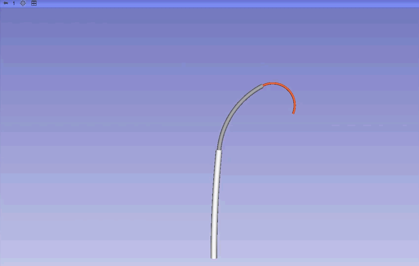
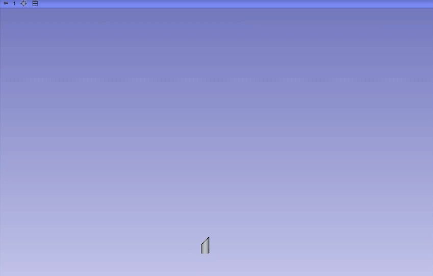

# SlicerCR

## Overview

SlicerRobo is a 3D Slicer module for visualizing and animating robotic systems within the medical imaging environment. It provides real-time rendering of both rigid-link and continuum robots by parsing URDF (Unified Robot Description Format) files and displaying them alongside medical imaging data.

## Demonstrations

Below are visual demonstrations of SlicerRoboViz capabilities:

### Robot Visualization Examples

<table align="center">
  <tr>
    <td align="center">
       
      <i>Hu et al., 2018, Computer Assisted Surgery.</i>
    </td>
    <td align="center">
       
      <i>Webste et al., 2006, IJRR.</i>
    </td>
  </tr>
</table>

<table align="center">
  <tr>
    <td align="center">
       
      <i>Webster et al., 2009, Exp. Robotics XI.</i>
    </td>
    <td align="center">
       
      <i>Custom Design</i>
    </td>
    <td align="center">
       
      <i>Oliver-Butler et al., 2021, IEEE T-RO.</i>
    </td>
  </tr>
</table>

<table align="center">
  <tr>
    <td align="center">
       
      <i>Amanov et al., 2021, IJRR.</i>
    </td>
    <td align="center">
       
      <i>Azizkhani et al., 2025, IEEE RA-L.</i>
    </td>
    <td align="center">
       
      <i>Wang et al., 2025, Device.</i>
    </td>
  </tr>
</table>

## Features

### URDF Support
- **Standard URDF Parsing**: Load conventional rigid-link robots defined in URDF format
- **Extended Continuum Support**: Parse custom URDF extensions for continuum/flexible robots
- **Multi-Robot Visualization** Simultaneously visualize multiple robots in the same scene

### Robot Motion & Animation
- **Joint State Updates**: Real-time update of revolute and prismatic joint positions
- **Smooth Animation**: Efficient updates for real-time robot motion visualization
- **Continuum Segment Visualization**: Render flexible segments with sample point based representations
- **Transform Hierarchy**: Maintain and update complete kinematic chains

### 3D Slicer Integration
- **Medical Image Overlay**: Visualize robots in the context of CT, MRI, and other medical images
- **Transform System**: Leverage 3D Slicer's transform nodes for robot kinematics
- **Parameter Nodes**: Store robot descriptions and states in Slicer's MRML scene
- **Interactive 3D Viewing**: Use Slicer's powerful 3D visualization capabilities

## Technical Architecture

### Core Components

1. [**SlicerRoboViz**](SlicerRoboViz/README.md): Main module providing the Slicer widget interface and logic
2. [**SlicerComm**](SlicerComm/README.md): Communication module providing Serial, TCP/IP, and UDP communications

### Dependencies

This module utilizes the **urdf_parser_py** library developed by the ROS (Robot Operating System) community:

- **Repository**: [https://github.com/ros/urdf_parser_py](https://github.com/ros/urdf_parser_py)
- **Integration**: Embedded in `Dependencies/urdf_parser_py/` with extensions for continuum robots

#### Acknowledgment

We gratefully acknowledge the ROS community and the contributors to the `urdf_parser_py` project. The library provides the foundation for URDF parsing in this module. We have extended it to support custom continuum robot descriptions while maintaining compatibility with standard URDF formats.

## Installation

1. Install [3D Slicer](https://download.slicer.org/) (version 5.0 or later recommended)
2. Clone or download this repository
3. In 3D Slicer, go to: `Modules` → `Extension Wizard` → `Select Extension` 
4. Choose `SlicerCR` directory 
5. Restart 3D Slicer
6. Find "SlicerRoboViz" under the "SlicerCR" category in the module selector

## Developer Information

**Author**: Letian Ai  
**Organization**: BM2 Lab, Georgia Institute of Technology  
  
## Contributing

Contributions are welcome! 

## License
BSD-3-Clause License

## References

1. ROS URDF Parser: [https://github.com/ros/urdf_parser_py](https://github.com/ros/urdf_parser_py)
2. URDF Specification: [http://wiki.ros.org/urdf/XML](http://wiki.ros.org/urdf/XML)
3. 3D Slicer: [https://www.slicer.org/](https://www.slicer.org/)

## Support

For issues, questions, or feature requests, please contact the BM2 Lab or open an issue in the repository.
